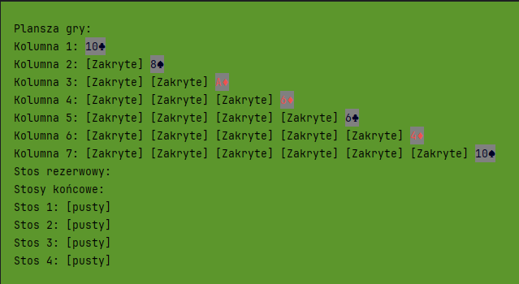

# <i>Zagrajmy w Pasjansa</i>



## Wymagania
- Python 3.8+
- Biblioteki: 
  - Pobierz wymagane biblioteki uruchamiając skrypt
       
   ```bash
   pip install -r requirements.txt
   ``` 

## Uruchomienie gry
1. Pobierz projekt i rozpakuj archiwum.
2. W terminalu przejdź do folderu projektu.
3. Uruchom grę poleceniem:
   ```bash
   python controller.py
   ```

## Instrukcja
1. Wybierz poziom trudności gry (łatwy/trudny).
2. Graj zgodnie z zasadami pasjansa:
   - Przenoś karty między kolumnami.
   - Przenoś karty na stosy końcowe.
   - Dobieraj karty ze stosu rezerwowego.
3. Cofnij do 3 ostatnich ruchów, jeśli popełnisz błąd.
4. Ułóż wszystkie karty na stosach końcowych, aby wygrać.

## Sterowanie
 - <i>Dostępne sterowanie potrzebne do gry jest wyświetlane przy wykonaniu każdego ruchu</i>
<br><br>
- Lista ruchów dostępnych w grze z pozycji menu
  - Wciśnięcie 0 - Wybieranie poziomu trudności (Dostępne tylko podczas 1 tury)
     - Dostępne opcje to:
        - Trudny - Na tym poziomie można dobierać po 3 karty, ale użyć można tylko wierzchniej.
        - Łatwy  - Na tym poziomie można dobierać po 1 karcie  
  - Wciśnięcie 1 - Dobranie karty ze stosu
  - Wciśnięcie 2 - Przeniesienie karty
    - Posiada opcje przenoszenia kart z Kolumny i Rezerwy (K: Kolumna, R: Rezerwa)
    - Najpierw użytkownik wybiera gdzie chce przenieść kartę, a następnie jaką kartę chcę tam przenieść
  - Wciśnięcie 3 - Przeniesienie karty na stos końcowy
    - Posiada opcje przenoszenia kart z Kolumny i Rezerwy (K: Kolumna, R: Rezerwa)
    - Najpierw użytkownik wybiera na który stos końcowy chce przenieść kartę, a następnie jaką kartę chcę tam przenieść
  - Wciśnięcie 4 - Cofnięcie ruchu
  - Wciśnięcie 5 - Zakończenie gry przegraną
     - Pyta również użytkownika czy rozpocząć gre ponownie (Tak/Nie) 
  - Wciśnięcie 6 - Wyświetlenie zasad gry
  - Wciśnięcie 7 - Wyświetlenie rankingu graczy 
  - Wciśnięcie 8 - Wczytanie ostatniego zapisu gry (Dostępne tylko jeżeli owy zapis istnieje)

## Dodatkowe informacje
 - Gra jest zapisywana automatycznie co 2 tury
 - Plik zapisu jest szyfrowany
 - 
## Dokumentacja
- `/data` : Folder zawierający pliki informacyjne i pliki zapisu
  - `fernet.key` : Plik zawierający kod do enkrypcji pliku zapisu
  - `preview.png` : Zdjęcie ukazujące planszę gry
  - `rules.txt` : Plik tekstowy zawierający zasady gry w pasjansa
  - `save1.txt` : Zaszyfrowany plik zapisu
  - `scores.txt` : Plik zawierający tablice wyników
- `config.py` : Plik konfiguracyjny, służy do konfiguracji programu
- `controller.py` : Plik zawierający klase zarządzająca główną logiką aplikacji
- `logic.py` : Plik zawierający klase obsługującą logikę gry
- `models.py` : Plik zawierający 4 główne klasy obsługujące talie kart
  - `Card`: Klasa reprezentująca pojedynczą kartę
  - `CardStack`: Klasa reprezentująca stos kart
  - `Column`: Klasa reprezentująca kolumnę kart na planszy
  - `Deck`: Klasa reprezentująca talię kart
- `ui.py` : Plik zawierający klase odpowiedzialna za interfejs użytkownika 
- `utils.py` : Plik zawierający dodatkowe klasy i funkcje
  - `ErrorCode`: Enum przechowujący kody błędów i odpowiadające im komunikaty
  - `load_key` : Funkcja ładująca klucz szyfrowania
  - `encrypt_file` : Funkcja szyfrująca plik
  - `decrypt_file` : Funkcja deszyfrująca plik
  - `handle_error` : Funkcja obsługująca błędy i wyświetlająca odpowiednie komunikaty
  - `card_value` : Funkcja zwracająca wartość liczbową dla symboli kart
  - `strip_ansi` : Funkcja usuwająca kody ANSI z tekstu
  - `save_score` : Funkcja zapisująca wynik gry do pliku scores.txt
  - `read_scores` : Funkcja wczytująca wyniki z pliku scores.txt
  - `display_scores` : Funkcja wyświetlająca najlepsze wyniki w formie tabeli
- <i>Reszta dokumentacji jest zawarta w kodzie źródłowym gry</i>
## <i>Autor:  Kurowski Kacper
